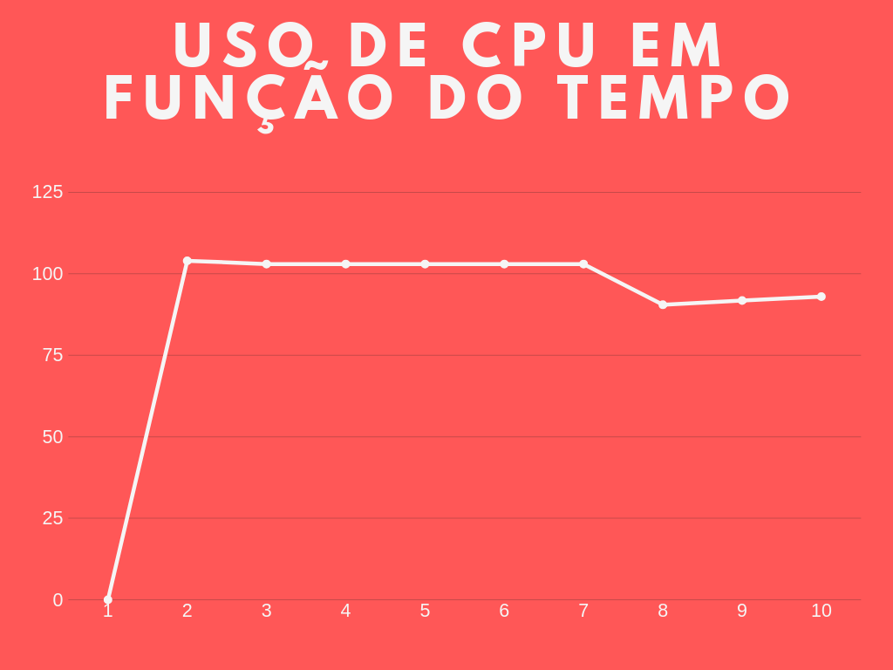
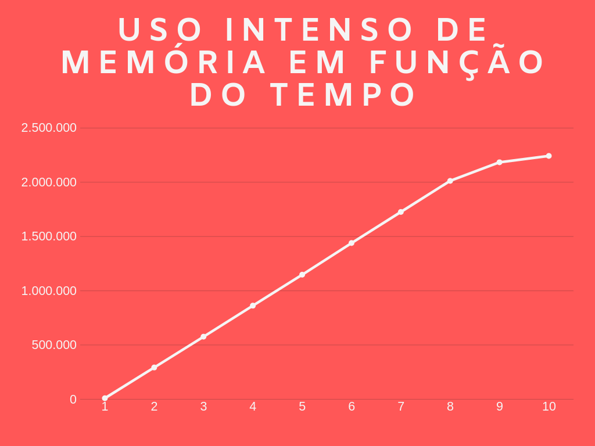
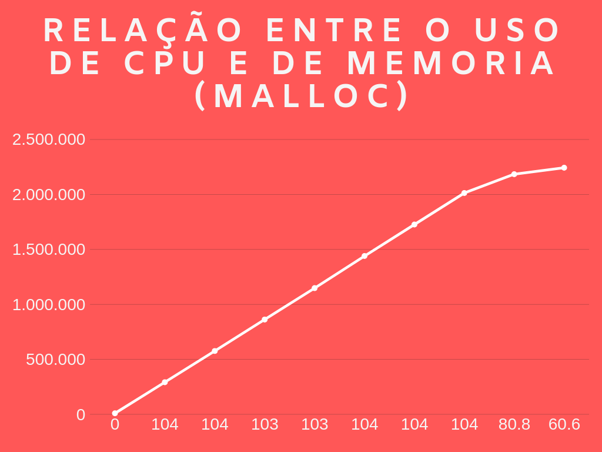

# Identificação

* Página do repositório do trabalho ([link GitHub]) 

* Discente 1
	* Nome: Carllos Eduardo Ferreira Lopes
	* Matrícula: 19111150
	* Distribuição da nota (%): 
* Discente 2
	* Nome: Jorge Lucas Alves de Almeida
	* Matrícula: 19111159
	* Distribuição da nota (%): 
* Discente 3
	* Nome: Rick Martim Lino dos Santos
	* Matrícula: 19111330
	* Distribuição da nota (%): 		
	
# Resultados

* TODO: Plotar um gráfico com os resultados das medições das seguintes métricas utilizadas para avaliar o comportamento do **processo filho**:
	*  **UCP**: consumo da UCP em porcentagem.
	  
	***ESSE GRÁFICO DE CIMA É O USO INTENSO DA CPU DURANTE OS 10S***
	
	É interessante observar que em um curto periodo de tempo o uso da CPU da um salto de 0% até o pico 104% e se matém assim até o segundo 7, onde tem uma leve queda.
	
	*  **UCP-MEM**: consumo da memória principal em Kilobytes.
	  
	***ESSE GRÁFICO DE CIMA É O USO INTENSO DA MEMÓRIA USANDO MALLOC DURANTE OS 10S***
	
	No gráfico acima da para se observar que a curva de crescimento é praticamente linear em que ao passar dos segundos de execução o consumo de memória se torna bastante alto.
	
	  
	***ESSE GRÁFICO DE CIMA É O USO CPU EM RELAÇÃO A MEMÓRIA USANDO MALLOC DURANTE OS 10S***
	
	No eixo X está o consumo da CPU em % em função da memória que está no eixo Y. Nota-se que o consumo da CPU atinge o seu pico 104% muito rápido e se mantem até o segundo 8, onde começa a baixar novamente.
	

# Discussão

## Utilização intensa da UCP

	Quando o programa é executado com o parametro "uso_cpu", na função main é processada a condição de funcionamento e repetição durante 10 segundos de monitoramento, após isso o processo "filho" é morto. Por conseguinte, o resultado obtido foi o desejado, tendo em vista que foi gerado uma utilização intensa da CPU com uma variação de 0% a 104% de uso da CPU enquanto o programa estava sendo executado.
	
	A primeira etapa do programa é a criação de um processo, chamado de processo "filho", por meio da função fork(). Esta função tem um retorno, se este retorno for um valor menor que 0 (zero), significa que houve um erro na criação do processo, retorna um valor maior que 0 (zero) caso seja o processo original, chamado de processo "pai" e retorn um valor igual a 0 (zero), caso seja o processo "filho", tal retorno é o distinguidor do processo (pid). Após isso serão feitas comparações, caso o pid seja menor que 0 é mostrada a mensagem "Falha ao criar o processo!" e o programa é encerrado, se o pid for maior que 0 o processo filho foi executado e retornou o id do seu processo para o pai, então o id do filho é salvo e convertido para uma string. Se o argumento for "uso_cpu", é executado o código de uso intenso da CPU, se o argumento for "cpu_e_memoria", é executado o codigo de uso intenso de CPU e Memória.
	
	Após identificado o argumento, o programa direciona a uma estrutura de repetição (for), com um loop finito, com uma condição de funcionamento de 10 segundos, o for vai "digitar" no terminal o comando salvo na string bash_cmd 10(dez) vezes. A função system(bash_cmd) é a responsável por inserir a string no bash do Linux de 1 em 1 segundo, sendo controlada pela função sleep. Diante disso, é fundamental que o processo filho seja "morto" e é a função system que fará isso através do comando(na forma de string) "Kill " seguido pelo pid do "filho". 
	
	

## Utilização intensa da UCP e memória

	Quando o programa é executado com o parâmetro "cpu_e_memoria", na função "main", é processada uma condição que simula o uso intenso da cpu através de um loop finito, porém muito longo, 

